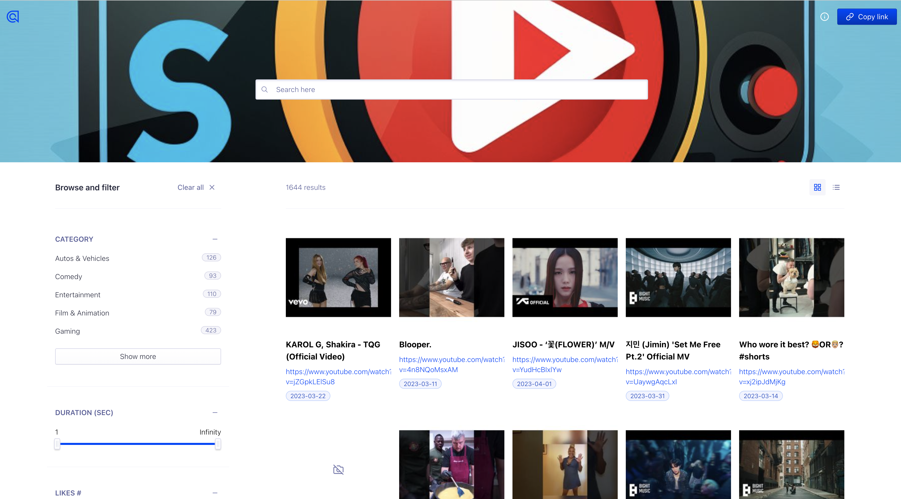

# Youtube Trending Indexer

The script fetches the top 20 trending videos by category (captures what was trending based on the previous 10 days). It then pushes it to an index in algolia (https://www.algolia.com/) which helps create a simple search UI. You will be able to search by title, comment, description, duration, trending date, and other stats. 

Screenshot of the search UI: 

List of API calls are being used to fetch the necessary data (API for reference: https://developers.google.com/youtube/v3/docs): 
1. videoCategories API call: https://www.googleapis.com/youtube/v3/videoCategories?part=snippet&regionCode={}&key={}
- Helps with getting the list of categories

2. videos API call: https://www.googleapis.com/youtube/v3/videos?part=snippet,statistics,contentDetails&chart=mostPopular&maxResults=20&regionCode={}&key={}&publishedAfter={}T00:00:00Z&videoCategoryId={}
- Helps with getting the list of trending videos 

3. channels API call: https://www.googleapis.com/youtube/v3/channels?part=statistics&id={}&key={}
- Helps with getting the channel stats 

4. commentThreads API call: https://youtube.googleapis.com/youtube/v3/commentThreads?part=snippet&order=relevance&videoId={}&key={}
- Helps with getting the relevant comments on a specific video 

